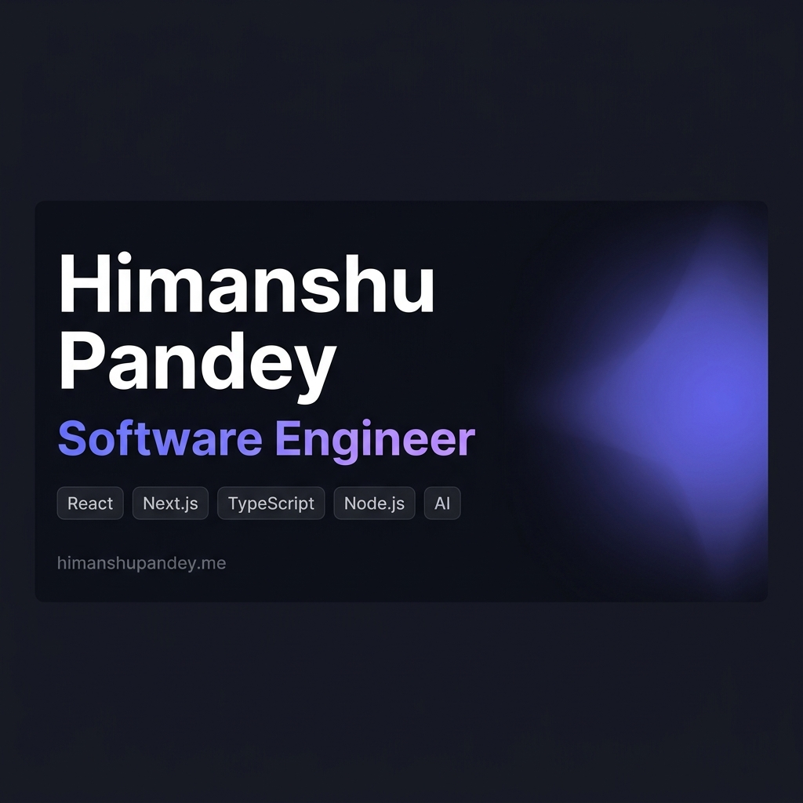

# Himanshu Pandey | Full-Stack Portfolio

<div align="center">
  
</div>

<br />

<div align="center">
  <a href="https://himanshupandey.me"><strong>Website</strong></a> ·
  <a href="#-tech-stack"><strong>Tech Stack</strong></a> ·
  <a href="#-local-development"><strong>Local Setup</strong></a> ·
  <a href="#-docker-deployment"><strong>Docker</strong></a>
</div>

<br />

<div align="center">
  
  
  
  
  
</div>

<br />

A high-performance, production-ready developer portfolio built to showcase full-stack capabilities. It features a completely custom design system, real-time WebSockets integration, and enterprise-grade Docker containerization.

## ✨ Features

- **Premium UI/UX**: Custom mesh gradients, glassmorphism, floating navigational elements, and meticulously crafted Framer Motion animations.
- **Real-time WebSockets**: Integrated with Pusher for live data capabilities.
- **Serverless API**: Custom contact form backend powered by **Resend** for reliable email delivery.
- **Production Optimized**: Next.js standalone output, zero-layout-shift fonts, and highly optimized SVGs.
- **SEO & Analytics**: Fully configured JSON-LD, Open Graph metadata, Vercel Speed Insights, and Vercel Analytics.
- **Enterprise Ready**: Includes a multi-stage Dockerfile optimized for minimal footprint deployments.

---

## 🛠️ Tech Stack

### Frontend
- **Framework**: [Next.js (App Router)](https://nextjs.org/)
- **Language**: [TypeScript](https://www.typescriptlang.org/)
- **Styling**: [Tailwind CSS v4](https://tailwindcss.com/)
- **Animations**: [Framer Motion](https://www.framer.com/motion/)
- **Icons**: [Lucide React](https://lucide.dev/)

### Backend & Infrastructure
- **WebSockets**: [Pusher](https://pusher.com/)
- **Email API**: [Resend](https://resend.com/)
- **Containerization**: [Docker](https://www.docker.com/)
- **Deployment & Analytics**: [Vercel](https://vercel.com/)

---

## 🚀 Local Development

### Prerequisites
- Node.js 18.17+
- npm or yarn

### 1. Clone the repository
```bash
git clone https://github.com/14-himanshu/portfolio-main.git
cd portfolio-main
```

### 2. Environment Variables
Create a `.env.local` file in the root directory and add the following keys:
```env
# Resend (For Contact Form)
RESEND_API_KEY=your_resend_api_key
CONTACT_EMAIL=your_email@domain.com

# Pusher (For WebSockets)
PUSHER_APP_ID=your_app_id
NEXT_PUBLIC_PUSHER_KEY=your_pusher_key
PUSHER_SECRET=your_pusher_secret
NEXT_PUBLIC_PUSHER_CLUSTER=ap2
```

### 3. Install & Run
```bash
npm install
npm run dev
```
Open [http://localhost:3000](http://localhost:3000) in your browser.

---

## 🐳 Docker Deployment

This project uses Next.js **Standalone Output Mode** via a highly optimized multi-stage `Dockerfile`. 

To build and run the production container locally:

```bash
# Build the extremely lightweight production image
docker build -t portfolio-app .

# Run the container (injecting your environment variables)
docker run -p 3000:3000 --env-file .env.local portfolio-app
```

---

## 📄 License

This project is open-source and available under the [MIT License](LICENSE).
